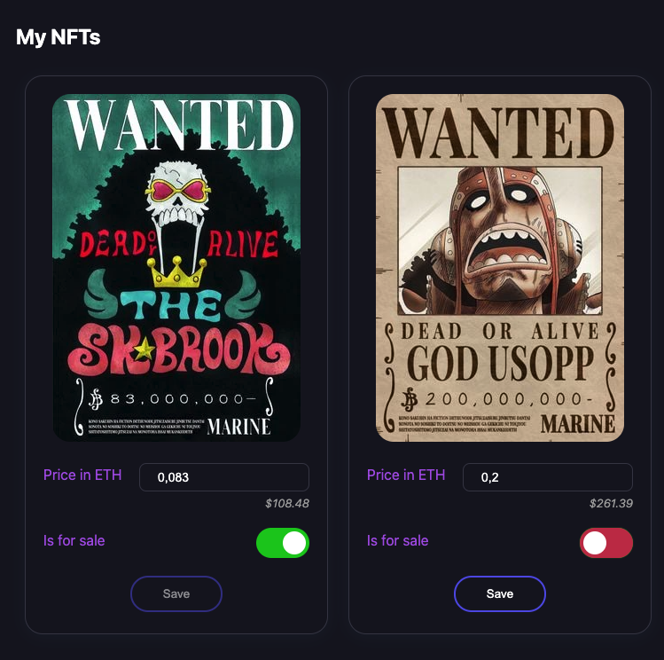

# My NFT Marketplace

A web application that enables users to:
- view NFTs for sale, 
- buy NFTs using Metamask wallet,
- create new NFTs,
- view and edit their own NFTS.

#### Screenshots


_View and buy NFTs for sale_


_Create a new NFT_


_Vien and edit your own NFTs_

#### User flow

1. Users connect their account to Metamask after pressing **Connect Wallet** button (the app attempts to do this automatically if there is an existing account logged in in Metamask).
2. Once an account is connected, the app displays a list of all the NFTs for sale.
3. User can click the **Buy** button on an NFT. Metamask popup is opened displaying the total cost and the option to confirm the transaction.
4. User can click the **My NFTs** button to view all owned NFTs. There is the option to toggle whether an NFT is for sale and edit its price. The changes are persisted only after clicking the **Save** button and confirming the transaction on Metamask.
5. User can click the **Create NFT** button to create a new NFT. The user selects and image from the computer's file system and sets a price in ETH. After clicking the **Create NFT** button, the image is uploaded to IPFS and metamask popup is opened displaying the total cost and the option to confirm the transaction.

#### Architecture
This is a dApp (decentralized application) with a simple frontend that connects with a smart contract in Ethereum blockchain and a file storage service using IPFS.


#### Tech Stack

- **Solidity** for Smart Contract development.
- **Hardhat** for Ethereum development environment.
- **Ethers** for the web app to interact with the smart contract.
- **Metamask** for in-browser user authentication.
- **Next.js / React.js** for the web application development.
- **Mocha / Chai** for testing the smart contract.

## Running locally

#### Prerequisites
1. Chrome browser with Metamask extension installed
2. IPFS installed locally on the computer

#### Instructions to run the app

First, initialize a hardhat node (the command should keep running):

```bash
npx hardhat node
```

Then, deploy the smart contract to the localhost network:

```bash
npx hardhat run --network localhost scripts/deploy.ts
```

Then, initialize an IPFS node (the command should keep running):

```bash
ipfs daemon
```

Then, run the development server for the web app:

```bash
npm run dev
```

Open [http://localhost:3000](http://localhost:3000) in your browser.